## Next.js 14 Tutorial - 45 - Rendering

### [Rendering](https://nextjs.org/docs/app/building-your-application/rendering)

- Rendering is the process that transform the code you write into user interfaces

- In Next.js, choosing the right time and place to do this rendering is vital for building a performant application

- CSS, SSR and RSCs

- Rendering in React -> Rendering in Next.js

  - React의 Rendering을 먼저 이해한다.

- If you don't fully understand something in a video, try watching it again, maybe even a third time

 

## Next.js 14 Tutorial - 46 - Client-side Rendering (CSR)

### Rendering in React

- You'll remember React being the go-to library for creating Single Page Application (SPAs)

### Client-side Rendering

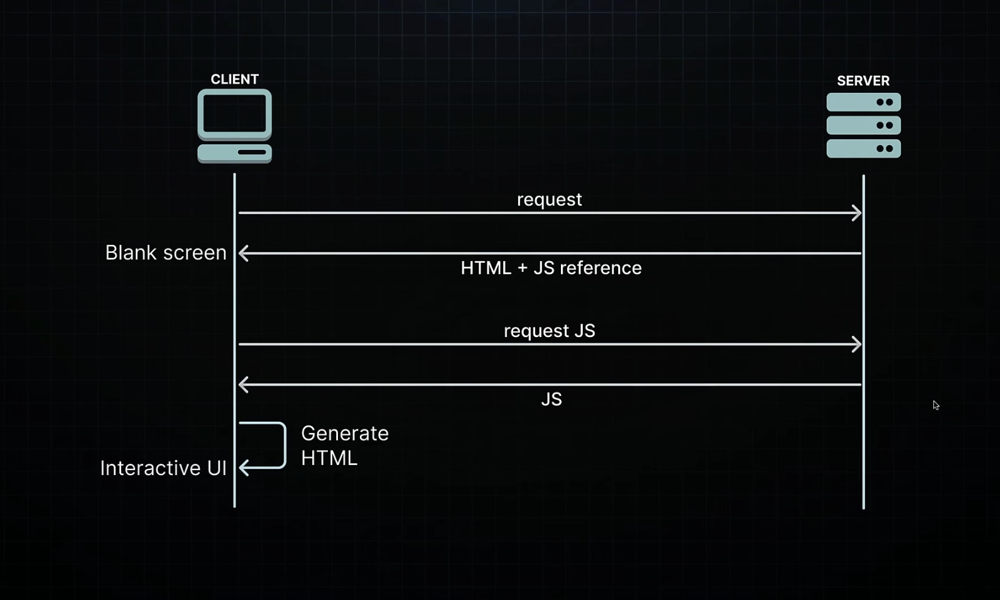

- This method of rendering, where the component is transformed into a user interface directly within the browser (the client), is known as client-side rendering (CSR)

- CSR quickly became the standard for SPAs, with widespread adoption

- It wasn't long before developers began noticing some inherent drawbacks to this approach

### Drawbacks of CSR

- SEO

  - Generating HTML that mainly contains a single div tag is not optimal for SEO, as it provides little content for search engines to index

- Performance

  - Having the browser(the client) handle all the work, such as fetching data, computing the UI, and making the HTML interactive, can slow things down. Users might see a blank screen or a loading spinner while the page loads

- Each new feature added to the application increases the size of the JavaScript bundle, prolonging the wait time for users to see the UI

 

## Next.js 14 Tutorial - 47 - Server-side Rendering (SSR)

### Recollecting Drawbacks of CSR

- Reliance on JavaScript for rendering content on the client side can significantly hurt SEO, as search engines might struggle to index the content properly

- The user experience can suffer from slow load times, as the browser has to download, parse, and execute JavaScript before the user sees any meaningful content on the page

### Server-side Solutions

- It significantly improves SEO because search engines can easily index the server-rendered content

- Users can immediately see the page HTML content, instead of a blank screen or loading spinner

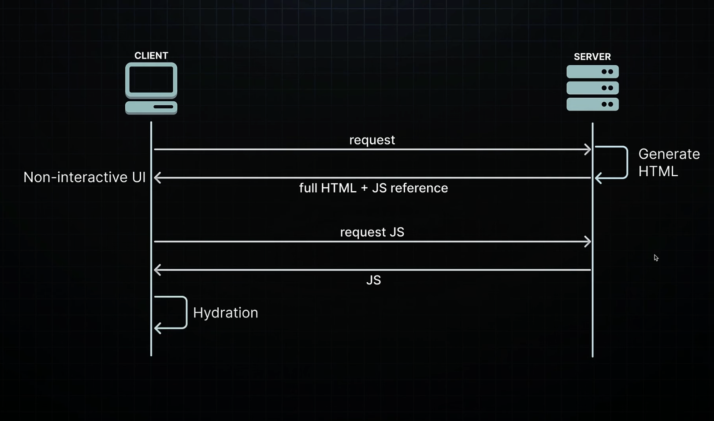

### Hydration

- During hydration, React takes control in the browser, reconstructing the component tree in memory based on the static HTML that was served

- It carefully plans the placement of interactive elements within this tree. Then, React proceeds to bind the necessary JavaScript logic to these elements

- This involves initializing the application state, attaching event handler for actions such as clicks and mouseovers, and setting up any other dynamic functionalities required for a fully interactive user experience

### Server-side Solutions

1. Static Site Generation (SSG)
2. Server-Side Rendering (SSR)

- SSG occurs at build time, when the application is deployed on the server. This results in pages that are already rendered and ready to serve. It is ideal for content that doesn't change often, like blog posts

- SSR, on the other hand, renders pages on-demand in response to user requests. It is suitable for personalized content like social media feeds, where the HTML depends on the logged-in user

- Server-Side Rendering (SSR) was a significant improvement over Client-Side Rendering (CSR) providing faster initial page loads and better SEO

### Drawbacks of SSR

**1. You have to fetch everything before you can show anything**

- Components cannot start rendering and then pause or "wait" while data is still being loaded

- If a component needs to fetch data from a database or another source (like an API), this fetching must be completed before the server can begin rendering the page

- This can delay the server's response to the browser, as the server must finish collecting all necessary data before any part of the page can be sent to the client

**2. You have to load everything before you can hydrate anything**

- For successful hydration, where React adds interactivity to the server-rendered HTML, the component tree in the browser must exactly match the server-generated component tree

- This means that all the JavaScript for the components must be loaded on the client before you can start hydrating any of them

**3. You have to hydrate everything before you can interact with anything**

- React hydrates the component tree in a single pass, meaning once it starts hydrating, it won't stop until it's finished with the entire tree

- As a consequence, all components must be hydrated before you can interact with any of them

### Drawbacks of SSR - All or Nothing Waterfall

1. having to load the data for the entire page
2. load the JavaScript for entire page, and
3. hydrate the entire page

- create an "all or nothing" waterfall problem that spans from the server to the client, where each issue must be resolved before moving toe the next one

- This is inefficient if some parts of you app are slower than others, as is often the case in real-world app

 

## Next.js 14 Tutorial - 48 - Suspense for SSR

### Drawbacks of SSR - All or Nothing Waterfall

1. Data fetching must be completed before the server can begin rendering HTML

2. The JavaScript required for the components needs to be fully loaded on the client side before the hydration process can start

3. All components have to be hydrated before they become interactive

- These issues contribute to an 'all-or-nothing' waterfall scenario, resulting in inefficiencies, especially if certain parts of you application are slower than others

- To address these performance drawbacks of SSR, react 18 introduced the Suspense SSR Architecture

### Suspense SSR Architecture

- Use the `<Suspense>` component to unlock two major SSR features:

1. HTML streaming on the server

2. Selective hydration on the client

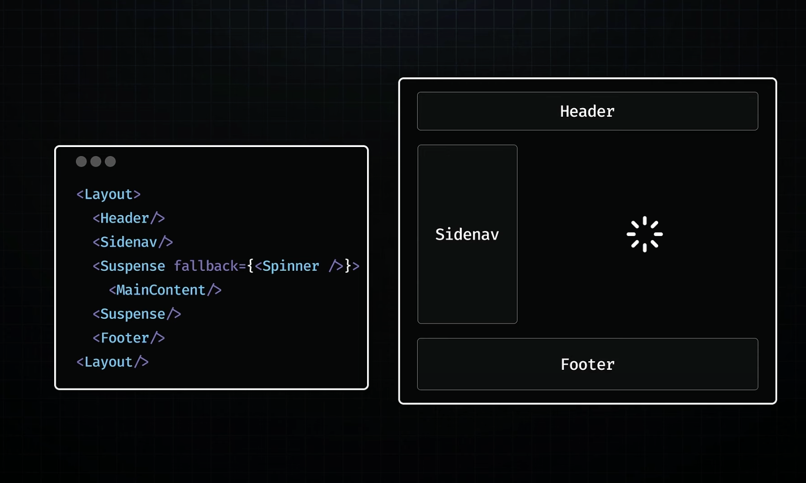

### HTML streaming on the server

- You don't have to fetch everything before you can show anything

- If a particular section delays the initial HTML, it can be seamlessly integrated into the stream later

- This is the essence of how Suspense facilitates server-side HTML streaming

- But we still have another problems

### The other challenge

- Until the JavaScript for the main section is loaded, client-side app hydration cannot start

- And if the JavaScript bundle for the main section is large, this could significantly delay the process

- To process this problem, Code splitting can be used

### Code splitting

- Code splitting allow you to mark specific code segments as not immediately necessary for loading, signalling your bundler to segregate them into separate `<script>` tags

- Using `React.lazy` for code splitting enables you to separate the main section's code from the primary JavaScript bundle

- The JavaScript containing React and the code for the entire application, excluding the main section, can now be downloaded independently by the client, without having to wait for the main section's code

### Selective Hydration on the Client

- By wrapping the main section within `<Suspense>`, you've indicated to React that it should not prevent the rest of the page from not just streaming but also from hydrating

- This feature, called **selective hydration** allows for the hydration of sections as they become available, before the rest of the HTML and the JavaScript code are fully downloaded

- Thanks to Selective Hydration, a heavy piece of JS doesn't prevent the rest of the page from becoming interactive

### Selective Hydration on the Client contd.

- Selective Hydration offers a solution to the third issue: the necessity to "hydrate everything to interact with anything"

- React begins hydrating as soon as possible, enabling interactions with elements like the header and side navigation without waiting for the main content to be hydrated

- This process is managed automatically by React

- In scenarios where multiple components are awaiting hydration, React prioritizes hydration based on user interactions

- for instance, if the side nav is about to be hydrated and you click on the main content area, react will synchronously hydrate the clicked component during the capture phase of the click event

- this ensures the component is ready to respond immediately to user interactions

- side nav is hydrated later on

- the three significant drawbacks of traditional SSR have all been addressed by the new suspense SSR architecture

- despite these improvements in SSR, few challenges still remain

### Drawbacks of Suspense SSR

- First, even though JavaScript code is streamed to the browser asynchronously, eventually, the entire code for a web page must be downloaded by the user

- As application add more features, the amount of code users need to download also grows. This leads to an important question:

- **Should users really have to download so much data ?**

- Second, the current approach requires that all React components undergo hydration on the client-side, irrespective of their actual need for interactivity

- This process can inefficiently spend resources and extend the loading times and time to interactivity for users, as their devices need to process and render components that might not even require client-side interaction

- **Should all component be hydrated, even those that don't need interactivity ?**

- Third, in spite of servers' superior capacity for handling intensive processing tasks, the bulk of JavaScript execution still takes place on the user's device

- The can slow down the performance, especially on devices that are not very powerful

- this leads to another important question:

- **Should so much of the work be done on the user's device?**

 

## Next.js 14 Tutorial - 49 - React Server Components (RSC)

### The Evolution of React

- CSR -> SSR -> Suspense for SSR

- Suspense for SSR brought us closer to a seamless rendering experience

- Challenges

  - Increased bundle size leading to excessive downloads for users

  - Unnecessary hydration delaying interactivity

  - Extensive client-side processing that could result in poor performance

### React Server Component (RSC)

- React Server Components (RSC) represent a new architecture designed by the React team

- This approach aims to leverage the strengths of both server and client environment, optimizing for efficiency, load times, and interactivity

- The architecture introduces a dual-component model

  - Client Components

  - Server Components

- This distinction is not based on the functionality of the components but rather on where they execute and specific environments they are designed to interact with

### Client Components

- Client Components are familiar React components we've been using

- They are typically rendered on the client-side (CSR) but, they can also be rendered to HTML on server (SSR), allowing users to immediately see the page's HTML content rather than a blank screen

- Components that primarily run on the client but can (and should) also be executed once on the server as an optimization strategy

### Client Components contd.

- Client Components have access to the client environment, such as the browser, allowing them to use state, effects and event listener to handle interactivity and also access browser-exclusive APIs like geolocation or localStorage, allowing you to build UI for specific use cases

- In fact, the term "Client Component" doesn't signify anything new; it simply helps differentiate these components from the newly introduced Server Components

### Server Components

- Server Components represent a new type of React component specifically designed to operate exclusively on the server

- And unlike client components, their code stays on the server and is never downloaded to the client

- This design choice offers multiple benefits to React applications

### Benefits of Server Components

- **Reduced Bundle Sizes**

  - Server Components do not send code to the client, allowing large dependencies to remain server-side

  - This benefits users with slower internet connections or less capable devices by eliminating the need to download, parse, and execute JavaScript for these components

  - Additionally, it removes the hydration step, speeding up app loading and interaction

- **Direct Access to Server-side Resource**

  - By having direct access to server-side resource like database or file systems, Server Components enable efficient data fetching and rendering without needing additional client-side processing

  - Leveraging the server's computational power and proximity to data sources, they manage compute-intensive rendering takes and send only interactive pieces of code to client

- **Enhanced Security**

  - Server Components' exclusive server-side execution enhances security by keeping sensitive data and logic, including tokens and API keys, away from the client-side

- **Improved Data Fetching**

  - Server components enhance data fetching efficiency

  - Typically, when fetching data on the client-side using useEffect, a child component cannot begin loading its data until the parent component has finished loading its own

  - This sequential fetching of data often leads to poor performance

  - The main issue is not the round trip themselves, but that these round trips are made from the client to the server

  - Server Components enable applications to shift these sequential round trips to the server side

  - By moving this logic to the server, request latency is reduced, and overall performance is improved, eliminating client-server "waterfalls"

- **Caching**

  - Rendering on the server enables caching of the results, which can be reused in subsequent requests and across different users

  - This approach can significantly improve performance and reduce costs by minimizing the amount of rendering and data fetching required for each request

- **Faster Initial Page Load and First Contentful Paint**

  - Sixth, Initial Page Load and First Contentful Paint (FCP) are significantly improved with Server Components

  - By generating HTML on the server, pages become immediately visible to users without the delay of downloading, parsing, and executing JavaScript

- **Improved SEO**

  - Regarding Search Engine Optimization (SEO), the server-rendered HTML is fully accessible to search engine bots, enhancing the indexability of your pages

- **Efficient Streaming**

  - Server Components allows the rendering process to be divided into manageable chunks, which are then streamed to the client as soon as they are ready

  - This approach allows users to start seeing parts of the page earlier, eliminating the need to wait for the entire page to finish rendering on the server

### RSC contd.

- Server Components take charge of data fetching and static rendering, while Client Components are tasked with rendering the interactive elements of the application

- The bottom line is that the RSC architecture enables React application to leverage the best aspects of both server and client rendering, all while using a single language, a single framework, and a cohesive set of APIs

### RSC Key Takeaways

- RSC introduce a new way of building React app by separating components into two types: Server Components and Client Components

- Server Components run only on the server, accessing data and preparing content without being sent to the browser, which makes the app faster for users because less information needs to download

- They can't manage clicks or interactions directly

- Client Components, on the other hand, work in the user's browser and handle all the interactive parts of the app, like clicking and typing

- They can also be rendered on the server for a fast initial load of the site. This setup helps make website faster, more secure, and easier for everyone to use, no matter where they are or what device they're using

### RSC and Next.js

- "This deep dive into the evolution of rendering in React is grate, but how exactly does it help understand rendering in Next.js? What's the connection?

- The App Router in Next.js is built around the RSC architecture

- All the features and benefits we've discussed are already baked into the lates version of Next.js

- By understanding the evolution of React's rendering, you now have the necessary background for the rest of this section which will focus on Next.js

 

## Next.js 14 Tutorial - 50 - Server and Client Components

### RSC + Next.js

- By default, every components in a Next.js app is considered a server component

- Link 태그로 클라이언트 컴포넌트의 라우트로 이동하는 경우에는 터미널에 console.log가 찍히지 않는다

- 하지만 해당 클라이언트 컴포넌트의 라우트에서 새로고침을 하면 console.log는 브라우저 뿐 아니라 terminal에도 찍히게 되는데 그 이유는 클라이언트 컴포넌트도 서버에서 한번 pre render되기 때문이다

  - client components are primarily executed in the client and have access to browser apis

  - but they are also also pre-rendered once on the server to allow the user to immediately see the Page's HTML content rather than a blank screen

  - it is an optimization strategy that nextjs implements and is recommended by react

  - the name client component is indeed confusing as a client component executes once on the server

  - but I'm confident it will not get in your way of learning react server components

  - a very important point to keep in mind to

### Summary

- In the RSC architecture and by extension in the Next.js app router, components are server components by default

- To use client components, you must include the use client directive at the top

- Server components are rendered only on the server

- Client components are rendered once on the server and then on the client

 

## Next.js 14 Tutorial - 51 - RSC Rendering Lifecycle

### RSC Rendering Lifecycle

- We're going to learn about the rendering lifecycle of server and client components

- In simpler terms, we'll explore how they come to life on your screen

- For React Server Components (RSC), it's important to consider three elements: your browser(the client), and on the server side, Next.js(the framework) and React(the library)

### RSC Loading Sequence

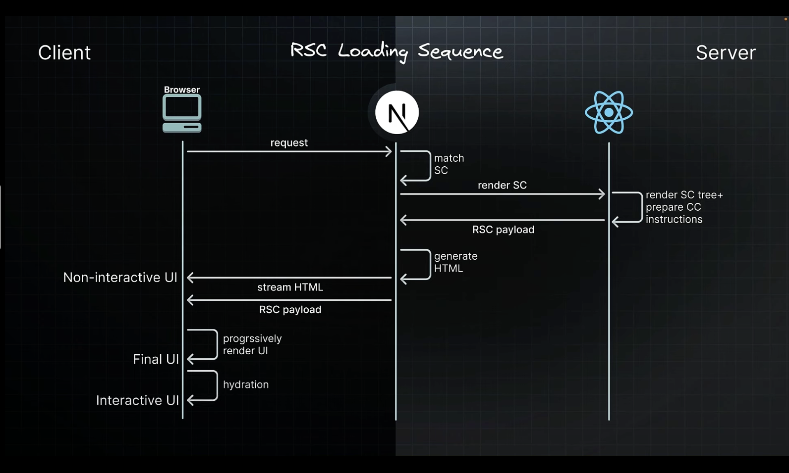

- let's break down the initial loading sequence step by step

- when your browser requests a page(1.request), the next js app router matches the requested URL to a server component (2.match SC)

- next js then instructs react to render that server component (3.render SC)

- react renders the server component and any child components that are also server components, converting them into a special Json format known as the RSC payload (4.render SC tree + prepare CC instruction)

- if you inspect the network tab when navigating to a route

- you will come across this special Json format which is the RSC payload

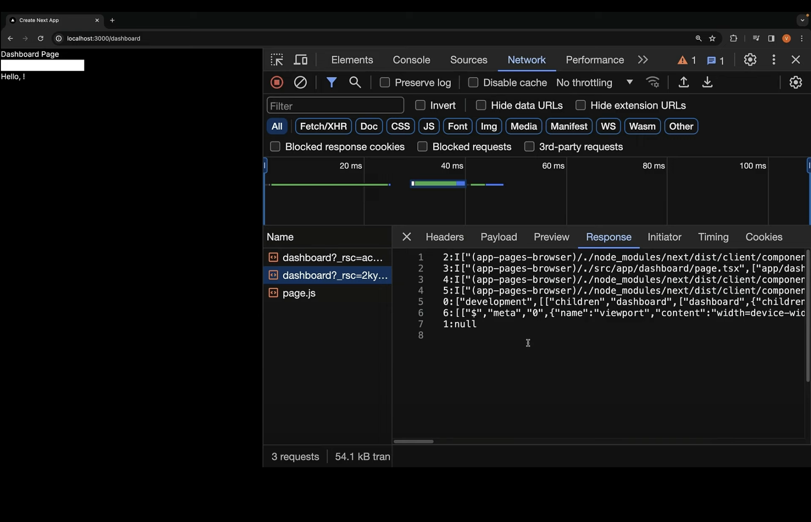

- 네트워크 탭 보면 확인할 수 있다.

- during this rendering if any server component suspends, react pauses rendering of that subtree and sends a placeholder value instead

- meanwhile client components are prepared with instructions for later, in the life cycle

- next js uses the RSC payload(5.RSC payload) which includes the client component instructions to generate HTML on the server (6.generate HTML)

- this HTML is streamed to your browser to immediately show a fast non-interactive preview of the route (7.stream HTML -> Non-interactive UI)

- along side Next js streams the RSC payload as react renders each unit of UI (8.RSC payload -> Non-interactive UI)

- in the browser Next js processes the streamed react response

- react uses the RSC payload and client component instructions to progressively render the UI (9.progressively render UI)

- once all the components and the server components output has been loaded, the final UI state is presented to the user(10.Final UI)

- client components undergo hydration(11.hydration) transforming our app from a static display into an interactive experience (11.Interactive UI)

- this is the initial loading sequence

### RSC Update Sequence

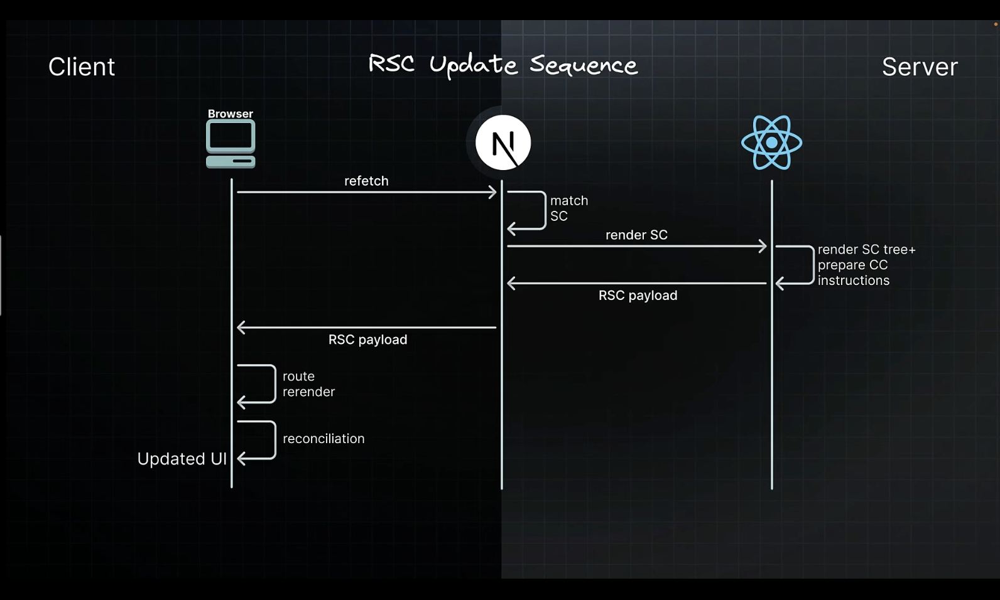

- let's take a look at the update sequence for refreshing parts of the app

- the browser requests a refetch of a specific UI such as a full route (1.refetch)

- next js processes the request and matches it to the requested server component (2.match SC)

- next instructs react to render the component tre (3.render SC)

- react renders the components similar to the initial loading (4.render SC tree+ prepare CC instructions)

- but unlike the initial sequence there is no HTML generation for updates

- next js progressively streams the response data back to the client (5.RSC payload, React -> Next.js -> Browser)

- on receiving the streamed response next js triggers a re-render of the route using the new output (6.route rerender)

- react reconciles or merges the new rendered output with the existing components on screen (7.reconciliation)

- since the UI description is a special Json format and not HTML, react can update the Dom while preserving crucial UI updates such as focus or input values

- this is the essence of the RSC rendering life cycle

### Server Rendering Strategies

- Static rendering

- Dynamic rendering

- Streaming

 

## Next.js 14 Tutorial - 52 - Static Rendering

### Static Rendering

- Static rendering is a server rendering strategy where generate HTML pages at the time of building our application

- This approach allows the page to be built once, cached by a CDN, and served to the client almost instantly

- This optimization also enables you to share the result of the rendering work among different users, resulting in a significant performance boost for your application

- Static rendering is particularly useful for blog pages, e-commerce product pages, documentation, and marketing pages

### How to Statically Render?

- Static rendering is the default rendering strategy in the app router

- All routes are automatically prepared at build time without additional setup

- "Throughout this video, you've mentioned that HTML is generated at build time. But there is no build for our application yet, is there? Aren't we running the application in development mode?"

### Production Server vs Dev Server

- For production, an optimized build is created once, and you deploy that build

- A development server, on the other hand, focus on the developer experience

- We can't afford to build our app once, make changes, rebuild, and so on

- For production builds, a page will be pre-rendered once when we run the build command

- In development mode, a page will be pre-rendered for every request

- npm run build 후 터미널에서 아래와 같은 결과를 확인할 수 있다.

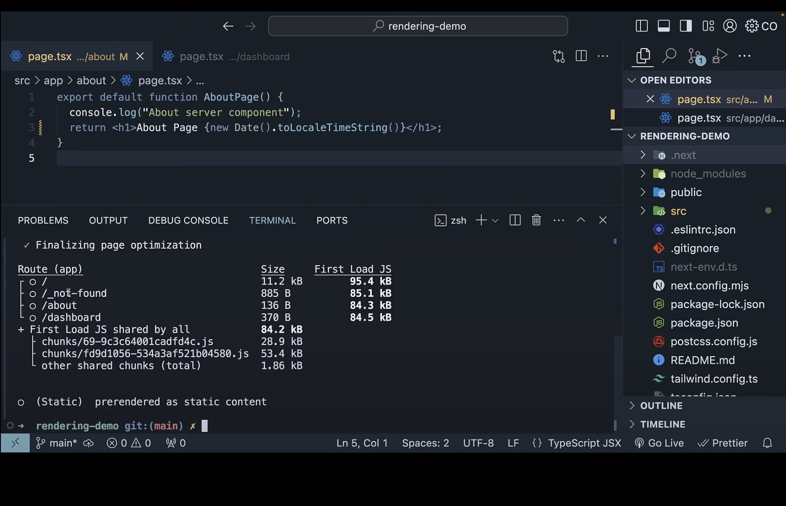

- it displays information about each route in our application with three columns route size and first load

- route refers to the route itself so about or dashboard for example

- size refers to the size of the assets downloaded when navigating to the corresponding route client side in the browser and first load JS refers to the size of assets downloaded when loading the page from the server

- the first load JS shared by all includes the CSS from `global.css` some runtime code, framework code, node modules vendor code like react for example and some code related to the routes and components in our application

- this is shown as a separate metric with the overall size being 84.2kb

- for the individual routes generated, we see the root page corresponding to page.tsx(`/`) in the app folder with a size of 11.2kb

 

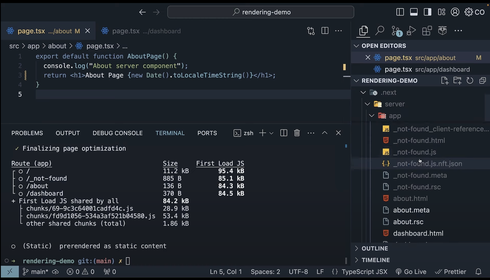

- run build 후, `.next` 폴더의 server/app 폴더 들어가면 build 결과로 나타나는 페이지에 해당하는 결과를 볼 수 있다

  - ex. index.html, \_not-found.html 등

- 그리고 `.rsc`로 끝나는 파일도 볼 수 있다

  - ex. about.html과 about.rsc, dashboard.html과 dashboard.rsc등

- In dashboard.html file, HTML corresponding to the about route containing a heading and input and a paragraph tag

- remember even client components are pre-rendered as an optimization step and that is the reason we see the client component HTML

  - 이러한 이유로 dashboard.tsx가 클라이언트 컴포넌트 이지만 dashboard.html 파일을 확인할 수 있는 것이다.

- besides HTML files, it's also important to note the RSC payload for each route

- for example we have about.rsc for the about server component and dashboard.rsc for the dashboard client component

- this special Json format generated by react for each route is a compact string representation of the virtual Dom

- it includes abbreviations, internal references and encoded special meanings

- for a server component, the payload includes the rendered result of the server component like the "h1" tag with the text "About Page "

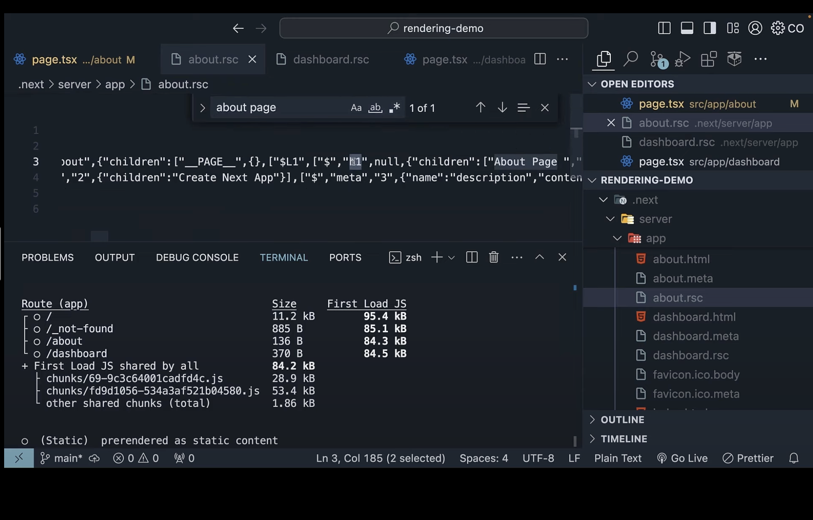

- the jsx from our component

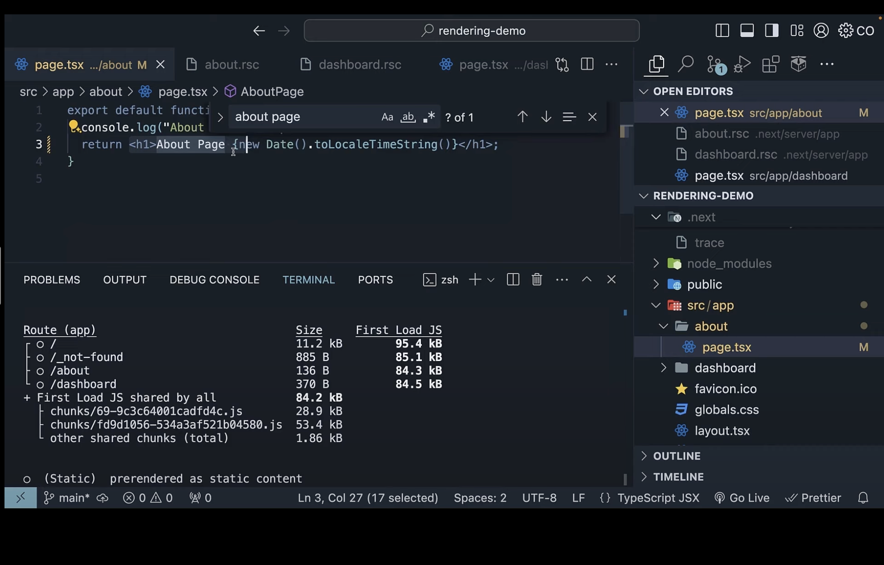

- 즉, about.rsc 파일에서 about/page.tsx 파일에 있는 h1 태그와 About Page 텍스트에 해당하는 정보를 확인할 수 있다.

 

- for a client component, however the payload includes placeholders or instructions where client components should be rendered along with references to their JavaScript files

- for instance the dashboard route which is a client component contains a reference to the code for the dashboard component

- if you were to search dashboard page in the dashboard.rsc we don't find it

  - dashboard.rsc에서 dashboard page 찾을 수 없다

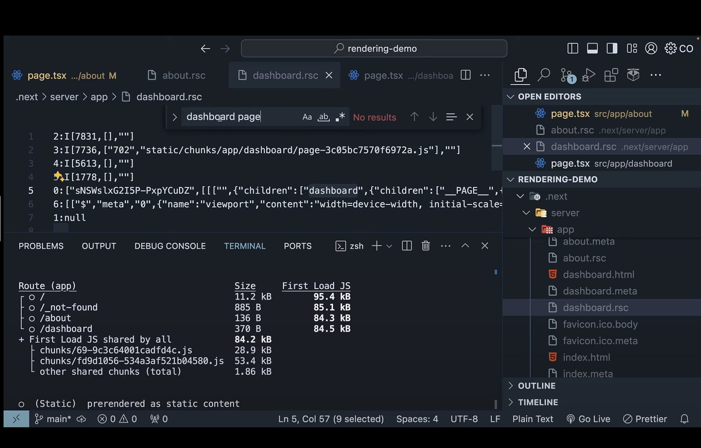

- however if we track this `page-3c05...` file in `static/chunks/app/dashboard`, you can see we have the H1 tag with the text dashboard page this is the file referenced in the RSC payload and this file contains the component code

- 하지만 "static/chunks/app/dashboard/page-" 이런식으로 경로가 있는 것을 확인할 수 있는데 해당 경로에 들어가면 자바스크립트 코드를 확인할 수 있다.

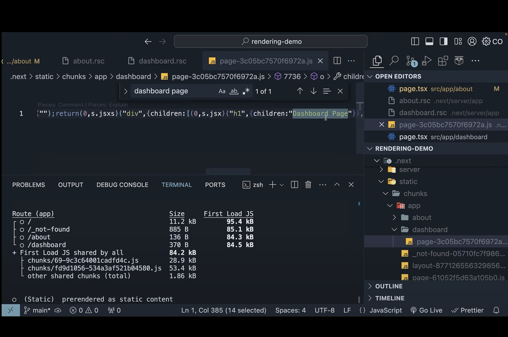

- this is the file referenced in the RSC payload and this file contains the component code necessary for reconciliation and hydration

 

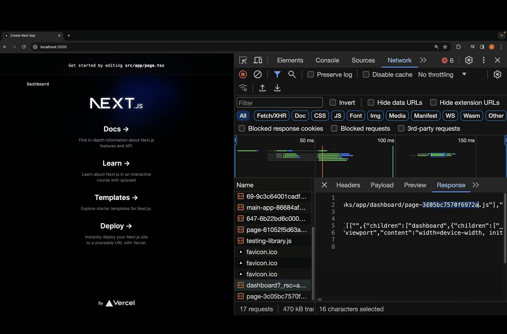

- 그리고 npm run start로 localhost:3000에 들어가면 dashboard.rsc 파일이 있는 것을 확인할 수 있다

- I want to draw your attention to the RSC file the one for dashboard

- this is essential for building the UI on the client side when we navigate to `/dashboard` using the Link

- the component code for the dashboard represented by `page-3c05` has also been downloaded

- if you navigate to the dashboard route you will notice that the route is rendered without the need to download any additional resources from the server

- `/dashboard` 경로는 Link 태그로 이동할 수 있는데, 이렇게 dashboard.rsc 파일을 미리 받아왔기 때문에 해당 경로로 이동해도 추가적인 다운로드가 없다.

- the initial load includes everything required for client side navigation

- however we must ask the question how does next js know to download the dashboard component code ahead of time

### Prefetching

- Prefetching is a technique used to preload a route in the background before the user navigates to it

- Routes are automatically prefetched as they become visible in the user's viewport, either when the page first loads or as it comes into view through scrolling

- For static routes, the entire route is prefetched and cached by default

- When we load the homepage, Next.js prefetches the About and Dashboard routes, keeping them ready for instant navigation

- but what about dashboard.html in the server folder we did not download that

- well this file is served when you directly navigate to the page in the browser

  - 즉, dashboard.html 파일은 새로고침 했을 때 다운로드 받는다

- for instance if you directly load the URL localhost:3000/dashboard, you receive the HTML for the dashboard along with the Code chip(위의 page-3c05...) to the client for hydration

- [Prefetching](https://nextjs.org/docs/app/building-your-application/routing/linking-and-navigating#2-prefetching)

### Static Rendering Summary

- Static rendering is a strategy where the HTML is generated at the build time

- Along with the HTML, the RSC payloads is created for each component, and JavaScript chunks are produced for client-side component hydration in the browser

- If you navigate to the route from a different one, the route is created on the client side using the RSC payload and JavaScript chunks, without any additional request to the server

- Static rendering is great for performance and use cases include blogs, documentation, marketing pages etc.

- [github](https://github.com/gopinav/Next.js-14-Tutorials/commit/5ee356670de157698e0b77840ef015ac658929a7)

 

## Next.js 14 Tutorial - 53 - Dynamic Rendering

### Dynamic Rendering

- Dynamic rendering is a server rendering strategy where routes are rendered for each user at request time

- It is useful when a route has data that is personalized to the user or contains information that can only be known at request time, such as cookies or the URL's search parameters

- New websites, personalized e-commerce pages, and social media feeds are some examples where dynamic rendering is beneficial

### How to Dynamically Render

- During rendering, if a dynamic function is discovered, Next.js will switch to dynamically rendering the whole route

- In Next.js these dynamic functions are: cookie(), headers(), and searchParams

- Using any of these will opt the whole route into dynamic rendering at request time

- [github](https://github.com/gopinav/Next.js-14-Tutorials/commit/17e93bf4514e61e375ece29f81b02ab1f67dd6f3)

  - npm run build 해보면 Dynamic page 심볼을 확인할 수 있다.

  - dynamic function 사용했기 때문

  - 네트워크 탭에서도 새로고침할 때 마다 새로운 html 파일 받아오는 것 확인할 수 있다.

  - 그리고 npm run build시 생기는 .next/server/app 폴더에서 about.html을 확인할 수 없는데 그 이유는 request 생길 때 마다 만들어서 응답하기 때문

  - but the HTML file is not generated in the server, since a new page is built for every request, there's no need to generate a page into the build folder

  - you can see we still don't have about.html

### Dynamic Rendering Summary

- Dynamic rendering is a strategy where the HTML is generated at request time

- Next.js automatically switches to dynamic rendering when it comes across a dynamic function in the component, such as cookies(), headers(), or the searchParams object

- This form of rendering is great when we need to render HTML personalized to a user, such as a social media feed

- As a developer, you do not need to choose between static and dynamic rendering. Next.js will automatically choose the best rendering strategy for each route based on the features and APIs used

 

## Next.js 14 Tutorial - 54 - Streaming

### Streaming

- Streaming is a strategy that allows for progressive UI rendering from the server

- Work is divided into chunks and streamed to the client as soon as it's ready

- This enables users to see parts of the page immediately, before the entire content has finished rendering

- Streaming significantly improves both the initial page loading performance and the rendering UI elements that rely on slower data fetches, which would otherwise block the rendering of the entire route

- Streaming is integrated into the Next.js App Router by default

- [github](https://github.com/gopinav/Next.js-14-Tutorials/commit/42ff7bb0b30b2548c94658a1c0073522e352d61a)

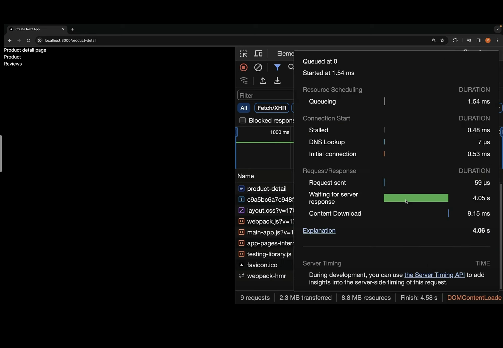

- Suspense를 사용하기 전에는 setTimeout에서 정해놓은 초가 지난 다음에 응답을 받을 수 있었다.

- 하지만 Suspense를 사용하면 각 컴포넌트의 setTimeout에서 정해놓은 초 만큼 Suspense의 fallback이 보이게 된다

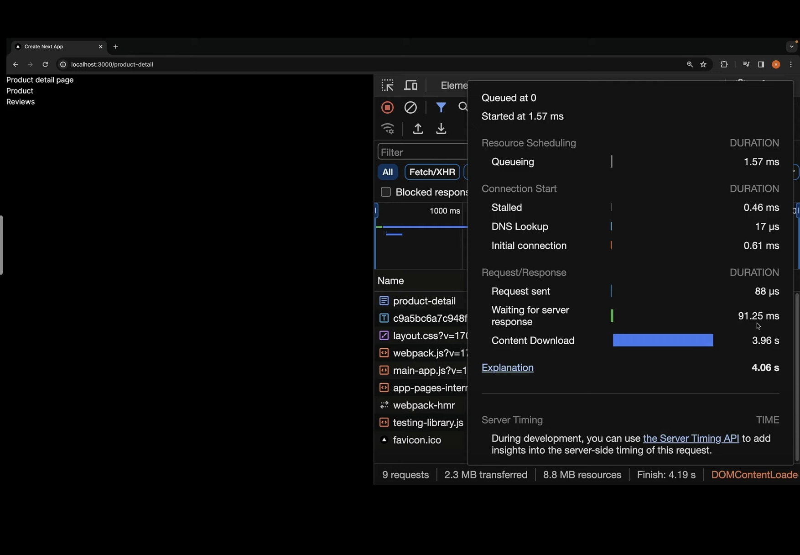

- 그리고 응답 속도도 훨씬 더 줄어든 것을 확인할 수 있다.

 

## Next.js 14 Tutorial - 55 - Server and Client Composition Patterns

### Server and Client Composition Patterns

- Server components

  - Fetching data

  - Directly accessing backend resources

  - Protecting sensitive information (like access tokens and API keys) on the server

  - Keeping large dependencies server-side, which helps in reducing client-side JavaScript

- Client

  - Adding interactivity

  - Handling event listeners (such as onClick(), onChange(), etc)

  - Managing state and lifecycle effects (using hooks like useSate(), useReducer(), useEffect())

  - Using browser-exclusive APIs

  - Using custom hooks

  - Using React Class components

 

## Next.js 14 Tutorial - 56 - Server-only Code

- Certain code is intended to execute only on the server

- You might have modules or functions that use multiple libraries, use environment variables, interact directly with a database, or process confidential information

- Since JavaScript modules can be shared, it's possible for code that's meant only for the server to unintentionally end up in the client

- If server-side code gets bundled into the client-side JavaScript, it could lead to a bloated bundle size, expose secrete keys, database queries, and sensitive business logic

- It is crucial to separate server-only code from client-side code to protect the application's security and integrity

### server-only Package

- Provide a build-time error if developers accidentally import one of these modules into a Client Component

- [github](https://github.com/gopinav/Next.js-14-Tutorials/commit/83d15bc8d5a7d5ad8e2449323603259a09265948)

  - 클라이언트 컴포넌트에서 serverSideFunction을 실행하면 에러가 발생한다.

 

## Next.js 14 Tutorial - 57 - Third Party Packages

### Third Party Packages

- Third-party packages in the ecosystem are gradually adapting, beginning to add the 'use client' directive to components that rely on client-only features, marking a clear distinction in their execution environment

- Many components from npm packages, which traditionally leverage client-side feature, haven't yet integrated this directive

- The absence of 'use client' means that while these components will function correctly in Client Components, they may encounter issues or might not work at all within Server Components

- To address this, you wrap third-party components that rely on client-side features in your own Client Components

- [github](https://github.com/gopinav/Next.js-14-Tutorials/commit/bad0f6b9448ac13391d1676068b9db2b3c99aa5e)

  - 서버 컴포넌트에서 직접 "react-slick" 을 import 해서 사용하면 에러가 발생하기 때문에 use client가 선언된 별도의 클라이언트 컴포넌트로 만들어서 서버 컴포넌트에서 import 해서 사용할 수 있도록 한다

 

## Next.js 14 Tutorial - 58 - Context Providers

### Context Providers

- Context providers are typically rendered near the root of an application to share global application state and logic

- For example, the application theme

- However, since React context is not supported in Server Components, attempting to create a context at the root of you application will result in an error

- To address this, you can create a context and render its provider inside a separate Client Component

- [github](https://github.com/gopinav/Next.js-14-Tutorials/commit/ef3f9af8610b88023b46d9480078027b0916a7d5)

  - provider 사용할 때, 별도의 컴포넌트로 만든 다음 children을 props로 받을 수 있도록 한다

 

## Next.js 14 Tutorial - 59 - Client-only Code

### Client-only Code

- Just as it's important to restrict certain operations to the server, it's equally important to confine some functionality to the client side

- Client-only code typically interacts with browsers-specific features like the DOM, the window object, localStorage etc which are not available on the server

- Ensuring that such code is executed only on the client side prevents errors during server-side rendering

- To prevent unintended server side usage of client side code, we can use a package called client-only

- [github](https://github.com/gopinav/Next.js-14-Tutorials/commit/01cb1e2e88b7297a20398e08936cb18a9bfa275b)

  - client-only가 상단에 선언된 파일을 서버 컴포넌트에서 import 해서 사용하면 에러가 발생한다

 

## Next.js 14 Tutorial - 60 - Client Component Placement

### Client Component Placement

- To compensate for server components not being able to manage state and handle interactivity, you need to create client components

- It's recommended to position these client components lower in your component tree

- the landing page component at the top the Navbar and main component as its children and the Navbar in turn has NavLinks and NavSearch as its children

- [github](https://github.com/gopinav/Next.js-14-Tutorials/commit/87f26c5438f44200f9e454635640d105e4c826a6)

  - 클라이언트 컴포넌트에서 import 하는 자식 컴포넌트는 모두 클라이언트 컴포넌트가 되기 때문에, 최대한 lower 한 위치에서 "use client"로 클라이언트 컴포넌트를 선언하는 것이 좋다

 

## Next.js 14 Tutorial - 61 - Interleaving Server and Client Components

- [github](https://github.com/gopinav/Next.js-14-Tutorials/commit/9b852095bad2a69b577f883a4f0fe66883925f2a)

  - 클라이언트 컴포넌트에서 서버 컴포넌트를 직접 import 하는 경우, 해당 서버 컴포넌트는 클라이언트 컴포넌트가 된다

  - 따라서 fs 모듈과 같이 node 함수를 사용하는 서버 컴포넌트를 직접 import 해서 사용하면 에러가 발생하기 때문에 children prop으로 전달할 수 있도록 한다
